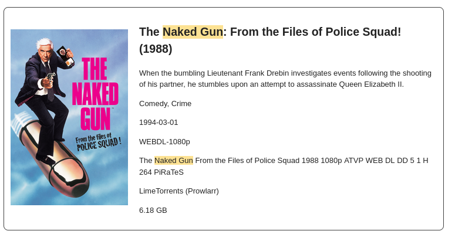
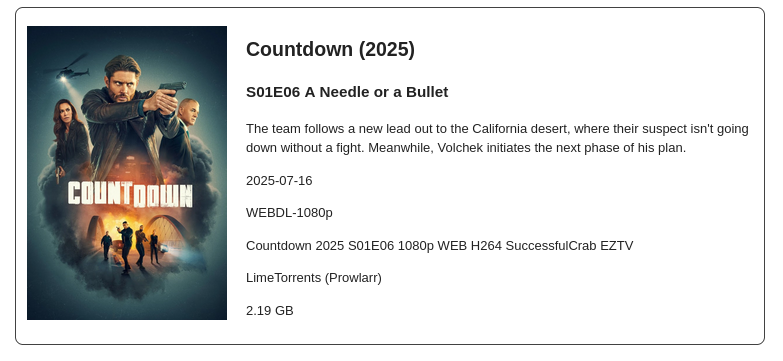

# Son of Rad Arr Notifications (aka SORAN)

A simple service to send Radarr and Sonarr notifications to an email address using Amazon SES
### Radar


### Sonar


## Using
SORAN can be quickly spun up using the provided docker compose sample file `compose.yaml.sample`. 

```yaml
services:
  sonofradarrnotifications:
    image: ghcr.io/mwcaisse/son-of-rad-arr-notifications
    ports:
      - "8080:8080"
    environment:
      SORAN_EMAIL_ACCESS_KEY: "<aws-access-key>"
      SORAN_EMAIL_SECRET_KEY: "<aws-secret-key>"
      SORAN_EMAIL_REGION: "<aws-region>" # i.e 'us-east-1'
      SORAN_EMAIL_FROM_ADDRESS: "<email-address-to-send-from>" #i.e. example@email.com
      SORAN_EMAIL_FROM_ADDRESS_NAME: "SORAN"
      SORAN_EMAIL_TO_ADDRESS: "<email-address-to-send-to>" # Email to receive the notifications i.e. bob@gmail.com
```

It currently only supports Amazon SES for sending emails, you will need to configure SES (https://aws.amazon.com/ses/)
